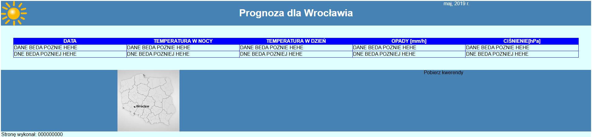

# Egzamin EE.09 (01.2022)

**Temat:** Tworzenie aplikacji internetowej zgodnie z wymaganiami egzaminacyjnymi kwalifikacji EE.09.  
**Data:** Styczeń 2022, wersja 02

## 📁 Struktura
- `index.html` – kod strony
- `styl.css` – style CSS
- `grafika/` – grafiki do strony

## 🧩 Wymagania
- Zgodność z treścią egzaminu EE.09
- Poprawne formatowanie i układ strony
- Grafika zgodnie z opisem zadania

## 📸 Podgląd strony

## 🏷️ Licencja
MIT

## ✍️ Autor
Bambikos • [GitHub](https://github.com/Bambikos)
